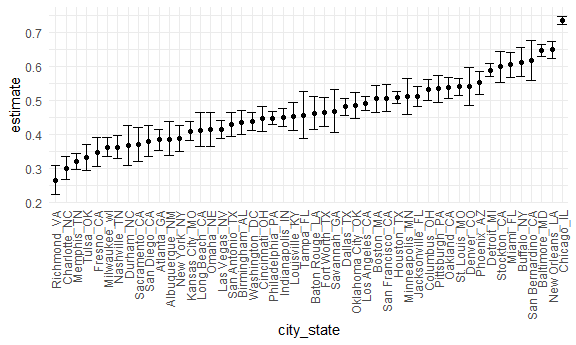
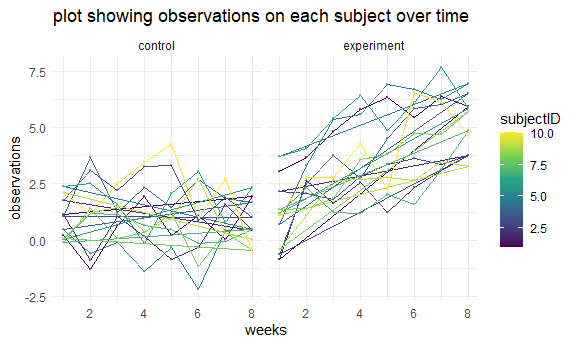
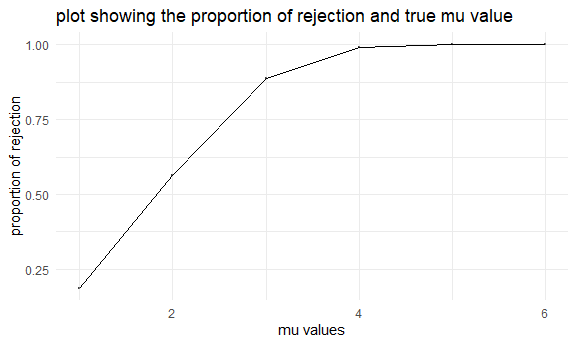

p8105\_hw5\_zw2709
================

## Problem 1

Read in the data.

``` r
homicide_df = 
  read_csv("homicide-data.csv") %>% 
  mutate(
    city_state = str_c(city, state, sep = "_"),
    resolved = case_when(
      disposition == "Closed without arrest" ~ "unsolved",
      disposition == "Open/No arrest"        ~ "unsolved",
      disposition == "Closed by arrest"      ~ "solved",
    )
  ) %>% 
  select(city_state, resolved) %>% 
  filter(city_state != "Tulsa_AL")
```

Let’s look at this a bit

``` r
aggregate_df = 
  homicide_df %>% 
  group_by(city_state) %>% 
  summarize(
    hom_total = n(),
    hom_unsolved = sum(resolved == "unsolved")
  )
```

    ## `summarise()` ungrouping output (override with `.groups` argument)

Can I do a prop test for a single city?

``` r
prop.test(
  aggregate_df %>% filter(city_state == "Baltimore_MD") %>% pull(hom_unsolved), 
  aggregate_df %>% filter(city_state == "Baltimore_MD") %>% pull(hom_total)) %>% 
  broom::tidy()
```

    ## # A tibble: 1 x 8
    ##   estimate statistic  p.value parameter conf.low conf.high method    alternative
    ##      <dbl>     <dbl>    <dbl>     <int>    <dbl>     <dbl> <chr>     <chr>      
    ## 1    0.646      239. 6.46e-54         1    0.628     0.663 1-sample~ two.sided

Try to iterate ……..

``` r
results_df = 
  aggregate_df %>% 
  mutate(
    prop_tests = map2(.x = hom_unsolved, .y = hom_total, ~prop.test(x = .x, n = .y)),
    tidy_tests = map(.x = prop_tests, ~broom::tidy(.x))
  ) %>% 
  select(-prop_tests) %>% 
  unnest(tidy_tests) %>% 
  select(city_state, estimate, conf.low, conf.high)
```

``` r
results_df %>% 
  mutate(city_state = fct_reorder(city_state, estimate)) %>% 
  ggplot(aes(x = city_state, y = estimate)) +
  geom_point() + 
  geom_errorbar(aes(ymin = conf.low, ymax = conf.high)) + 
  theme(axis.text.x = element_text(angle = 90, vjust = 0.5, hjust = 1))
```



## Problem 2

import one dataset

``` r
data_1 = read_csv("data/con_01.csv")
```

    ## Parsed with column specification:
    ## cols(
    ##   week_1 = col_double(),
    ##   week_2 = col_double(),
    ##   week_3 = col_double(),
    ##   week_4 = col_double(),
    ##   week_5 = col_double(),
    ##   week_6 = col_double(),
    ##   week_7 = col_double(),
    ##   week_8 = col_double()
    ## )

create the dataframe

``` r
path_df = 
  tibble(
    path = list.files("data"),
  ) %>%    # dataframe containing all file names
  mutate(
    path = str_c("data/", path),
    data = map(path, read_csv)) %>%  # Iterate over file names and read in data for each subject, saved in the new variable "data"
  unnest(data)
```

The dataframe containing data from all participants is as follows:

``` r
path_df
```

    ## # A tibble: 20 x 9
    ##    path            week_1 week_2 week_3 week_4 week_5 week_6 week_7 week_8
    ##    <chr>            <dbl>  <dbl>  <dbl>  <dbl>  <dbl>  <dbl>  <dbl>  <dbl>
    ##  1 data/con_01.csv   0.2  -1.31    0.66   1.96   0.23   1.09   0.05   1.94
    ##  2 data/con_02.csv   1.13 -0.88    1.07   0.17  -0.83  -0.31   1.58   0.44
    ##  3 data/con_03.csv   1.77  3.11    2.22   3.26   3.31   0.89   1.88   1.01
    ##  4 data/con_04.csv   1.04  3.66    1.22   2.33   1.47   2.7    1.87   1.66
    ##  5 data/con_05.csv   0.47 -0.580  -0.09  -1.37  -0.32  -2.17   0.45   0.48
    ##  6 data/con_06.csv   2.37  2.5     1.59  -0.16   2.08   3.07   0.78   2.35
    ##  7 data/con_07.csv   0.03  1.21    1.13   0.64   0.49  -0.12  -0.07   0.46
    ##  8 data/con_08.csv  -0.08  1.42    0.09   0.36   1.18  -1.16   0.33  -0.44
    ##  9 data/con_09.csv   0.08  1.24    1.44   0.41   0.95   2.75   0.3    0.03
    ## 10 data/con_10.csv   2.14  1.15    2.52   3.44   4.26   0.97   2.73  -0.53
    ## 11 data/exp_01.csv   3.05  3.67    4.84   5.8    6.33   5.46   6.38   5.91
    ## 12 data/exp_02.csv  -0.84  2.63    1.64   2.58   1.24   2.32   3.11   3.78
    ## 13 data/exp_03.csv   2.15  2.08    1.82   2.84   3.36   3.61   3.37   3.74
    ## 14 data/exp_04.csv  -0.62  2.54    3.78   2.73   4.49   5.82   6      6.49
    ## 15 data/exp_05.csv   0.7   3.33    5.34   5.57   6.9    6.66   6.24   6.95
    ## 16 data/exp_06.csv   3.73  4.08    5.4    6.41   4.87   6.09   7.66   5.83
    ## 17 data/exp_07.csv   1.18  2.35    1.23   1.17   2.02   1.61   3.13   4.88
    ## 18 data/exp_08.csv   1.37  1.43    1.84   3.6    3.8    4.72   4.68   5.7 
    ## 19 data/exp_09.csv  -0.4   1.08    2.66   2.7    2.8    2.64   3.51   3.27
    ## 20 data/exp_10.csv   1.09  2.8     2.8    4.3    2.25   6.57   6.09   4.64

Tidy the dataframe

``` r
df = 
  path_df %>% 
  mutate(
    path = str_replace(path, "data/", ""),
    path = str_replace(path, ".csv", "")
  ) %>% 
  separate(path, into = c("arm", "subjectID"), sep = "_") %>% 
  mutate(
    arm = str_replace(arm, "con", "control"),
    arm = str_replace(arm, "exp", "experiment"),
    subjectID = as.numeric(subjectID)
  ) %>% 
  
  pivot_longer(
    week_1:week_8,
    names_to = "weeks",
    values_to = "observations"
  ) %>% 
  
  mutate(
    weeks = str_replace(weeks, "week_", ""),
    weeks = as.numeric(weeks)
  )

df
```

    ## # A tibble: 160 x 4
    ##    arm     subjectID weeks observations
    ##    <chr>       <dbl> <dbl>        <dbl>
    ##  1 control         1     1         0.2 
    ##  2 control         1     2        -1.31
    ##  3 control         1     3         0.66
    ##  4 control         1     4         1.96
    ##  5 control         1     5         0.23
    ##  6 control         1     6         1.09
    ##  7 control         1     7         0.05
    ##  8 control         1     8         1.94
    ##  9 control         2     1         1.13
    ## 10 control         2     2        -0.88
    ## # ... with 150 more rows

Make a spaghetti plot showing observations on each subject over time

``` r
df %>% 
  
  ggplot(aes(x = weeks, y = observations, color = subjectID)) +
  geom_point(alpha = 0.5, size = 0.1)+
  geom_path()+
  facet_grid(. ~ arm)+
  
  labs(
    title = "plot showing observations on each subject over time",
    x = "weeks",
    y = "observations"
  ) +
  theme_minimal()
```



Over the 8 weeks of observation period, the experiment group seems to
have an increasing tread with some fluctuations. The control group have
changing values during the period, but the values from the beginning and
the end do not have a large difference.

## Problem 3

write a function

``` r
simulation = function(n = 30, mu, sigma = 5){
  
 data = 
    tibble(
      x = rnorm(n = 30, mean = mu, sd = sigma)
    )
  
 test = 
   t.test(data, conf.level = 0.95) %>% 
   broom::tidy() 
  
  data %>% 
    summarise(
     mu_hat = mean(x), 
     p_value = test$p.value
    )
  
}
```

do the iteration–generate 5000 dataset (mu = 0)

``` r
results_mu_0 = 
  rerun(5000, simulation(mu = 0)) %>% 
  bind_rows()

results_mu_0
```

    ## # A tibble: 5,000 x 2
    ##     mu_hat p_value
    ##      <dbl>   <dbl>
    ##  1  0.367    0.702
    ##  2  0.0165   0.986
    ##  3  0.140    0.890
    ##  4  0.162    0.858
    ##  5 -0.363    0.694
    ##  6 -0.549    0.467
    ##  7  1.43     0.137
    ##  8  0.272    0.773
    ##  9 -0.239    0.806
    ## 10 -0.750    0.340
    ## # ... with 4,990 more rows

Repeat the above for μ={1,2,3,4,5,6}

``` r
simulation_result = 
  tibble(
    mu = c(1,2,3,4,5,6)
  ) %>% 
  
  mutate(
    output_lists = map(.x = mu, ~ rerun(5000, simulation(mu = .x))),
    estimate_df = map(output_lists, bind_rows)
  ) %>% 
  
  select(-output_lists) %>% 
  unnest(estimate_df)
```

  - first plot Make a plot showing the proportion of times the null was
    rejected (the power of the test) on the y axis and the true value of
    μ on the x axis. Describe the association between effect size and
    power.

<!-- end list -->

``` r
reject = 
  simulation_result %>% 
  filter(p_value < 0.05) %>% 
  
  group_by(mu) %>% 
  summarize(
    reject = n()
  ) %>% 
  mutate(
    reject_prop = reject / 5000
  )
```

    ## `summarise()` ungrouping output (override with `.groups` argument)

``` r
reject
```

    ## # A tibble: 6 x 3
    ##      mu reject reject_prop
    ##   <dbl>  <int>       <dbl>
    ## 1     1    905       0.181
    ## 2     2   2871       0.574
    ## 3     3   4428       0.886
    ## 4     4   4923       0.985
    ## 5     5   4998       1.00 
    ## 6     6   5000       1

``` r
reject %>% 
  
  ggplot(aes(x = mu, y = reject_prop)) +
  geom_point(alpha = 0.5, size = 0.1)+
  geom_path()
```



``` r
  labs(
    title = "plot showing the proportion of rejection and true mu value",
    x = "mu values",
    y = "proportion of rejection"
  ) +
  theme_minimal()
```

    ## NULL

With the increase of the true value of mu, the proportion of
rejection(times of rejecting the null hypothesis) increases. When mu is
equal to 6, it’s certain to have rejection(proportion equals to 1). The
power(probability of rejecting false null hypothesis) seems to be
positively associated with the effect size.
